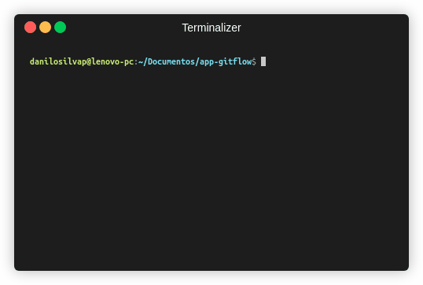

De forma simples e fácil, vamos aprender a configurar qualquer repositório GIT para utilizar o fluxo do Git Flow na prática! Vamos lá?

---
## Resumo
- Iremos **criar uma pasta** em nosso computador (em qualquer diretório que preferir)
- **Inicializaremos um repositório GIT** (partirei do pressuposto que você também já sabe como funciona um repositório)
- **Aplicaremos as configurações** do fluxo _Git Flow_ neste repositório.

---
## Mão na massa 😄

### Pré-requisitos

O **Git Flow** não é uma ferramenta padrão do **Git**, e por esse motivo precisamos antes de tudo realizar a instalação do plugin.

No Github tem o [passo a passo](https://github.com/nvie/gitflow/wiki/Installation) de como instalar em todos os ambientes.

### 1. Criando pasta

No diretório desejado, execute os comandos:

```console
mkdir app-gitflow        // criação de pasta
cd app-gitflow           // acessando pasta criada
```

### 2. Inicializando um repositório git

Dentro da pasta criada, execute o comando:

```console
git init
```

### 3. Configurando o fluxo Git Flow 

Por padrão, o Git Flow não vem configurado em um repositório GIT, logo vamos executar o **comando principal** e em seguida, você vai perceber o quão simples é configurar e ver este fluxo apto para uso. 

```console
git flow init
```

Ao executar este comando é iniciada um pequena série de definições feitas através do console.



Vamos entender cada item configurado, **se liga**

```js
// Primeiro, a definição dos branches principais
No branches exist yet. Base branches must be created now.

// 1. Defina qual o nome do branch que armazenará o código de produção
Branch name for production releases: [master] 
// Por padrão, o GIT sugere que seja: master
// Basta apertar ENTER

// 2. Defina qual o nome do branch de desenvolvimento principal
Branch name for "next release" development: [develop]
// Por padrão, o GIT sugere que seja: develop
// Basta apertar ENTER

// Agora, a definição dos branches de apoio
How to name your supporting branch prefixes?

// 3. Defina o prefixo dos branches features
Feature branches? [feature/]
// Por padrão, o GIT sugere que seja: feature/
// Basta apertar ENTER

// 4. Defina o prefixo dos branches bugfixs
Bugfix branches? [bugfix/]
// Por padrão, o GIT sugere que seja: bugfix/
// Basta apertar ENTER

// 5. Defina o prefixo dos branches releases
Release branches? [release/]
// Por padrão, o GIT sugere que seja: release/
// Basta apertar ENTER

// 6. Defina o prefixo dos branches hotfixs
Hotfix branches? [hotfix/]
// Por padrão, o GIT sugere que seja: hotfix/
// Basta apertar ENTER

// 6. Defina o prefixo dos branches supports
Support branches? [support/]
// Por padrão, o GIT sugere que seja: support/
// Basta apertar ENTER

// 7. Defina o prefixo para cada versão gerada através de tags
Version tag prefix? []
// Basta apertar ENTER

// 7. Indique a pasta onde ficará os scripts(ganchos) personalizados do repositório
Hooks and filters directory? [<diretorio>/app-gitflow/.git/hooks]
// Por padrão, o GIT sugere a configuração padrão, alocada dentro da própria pasta
// Basta apertar ENTER
```

> ✅ Pronto, simples e rápido, já temos um modelo para **aplicarmos em qualquer repositório** durante o desenvolvimento de qualquer projeto ou aplicação!

> ⚡️ _Dica rápida_ <br></br>
Você deve ter percebido que não precisamos configurar nenhum prefixo ao executar o **comando principal**, bastou **ENTER** a cada linha.
Para pular essas configurações e configurar o fluxo de forma padrão, execute o comando principal com a flag **-d**:
```console
git flow init -d
```

---
## Considerações finais

Ainda nesta *série sobre Git Flow* você encontrará explicações e usos práticos de cada conjuntos de _branches_.

Recomendo que você explore cada uma delas pois, logo, você vai sentir que está _dominado o ciclo de desenvolvimento de uma aplicação, de ponta-a-ponta, e ter total capacidade de ajudar sua equipe de  desenvolvimento!_

---
**Obrigado por chegar até aqui!** 😄