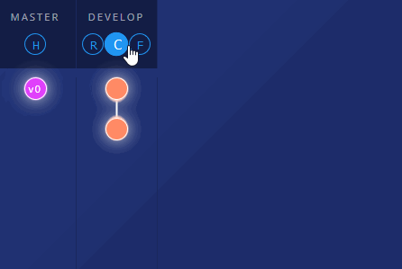

Vamos aprender para que servem os branches chamadas de features e como aplicar o uso delas ao desenvolvimento.

---
## Definição

**Features** são _branches_ para o desenvolvimento de uma funcionalidade específica, por convenção elas têm o prefixo ***feature/***.

- _feature/cadastro-pessoa_

Importante ressaltar que as _features_ (vamos nos acostumar a chamá-lás assim) são criadas *sempre* à partir da _branch_ *develop*.

> 📌 O <u>conceito de feature</u> é aplicado entendendo que **em cada uma** será realizado o desenvolvimento de **uma tarefa/história/demanda**, sendo assim ser possível organizar o fluxo de desenvolvimento por tarefas concluídas e terem suas criações e/ou alterações sempre presentes na develop (_branch_ principal de desenvolvimento).



> 📝 _Descrição da imagem:_ <br/>
Criação de uma feature a partir da develop _(F - Nova feature)_ e no final do desenvolvimento da funcionalidade _(C - Commit)_ é realizada a mesclagem com a develop _(M - Merge)_.

---
## Features na prática 😎

### Pré-requisitos

- Ter o GIT instalado
- Qualquer repositório com o fluxo do Git Flow inicializado e configurado.

### 1. Criação de features

Para criar uma feature é bem simples:

```console
git flow feature start <nome-funcionalidade-ou-tarefa>
```

Com um comando neste padrão, **será criada uma nova branch através da develop** com o prefixo _feature/_, seguido do nome que você inserir.
Execute:

```console
git flow feature start cadastrar-pessoa
```

O retorno do comando é uma nova _branch_ entitulado **feature/cadastrar-pessoa** e já é realizado _checkout_ nessa nova _branch_.

```console
[saída do console]                                                       
Switched to a new branch 'feature/cadastrar-pessoa'

Summary of actions:
- A new branch 'feature/cadastrar-pessoa' was created, bases on 'develop'
- You are now on branch 'feature/cadastrar-pessoa'

Now, start committing on your feature. When done, use:
    git flow feature finish cadastrar-pessoa
```

### 2. Finalização de features

Após terminar o desenvolvimento da funcionalidade, ser feito N commits, a _branch_ estará pronta para ser finalizado e mesclado à develop.

Então você verificou que **está na feature, não há nenhum commit a ser feito e nenhum arquivo pendente...**

```console
git checkout feature/cadastrar-pessoa
git status
```

```console
[saída do console]                         
No ramo feature/cadastrar-pessoa                  
nothing to commit, working tree clean
```

**Para finalizar uma feature**, basta:

```console
git flow feature finish <nome-funcionalidade-ou-tarefa>
```

> O nome da feature é opcional quando você já está presente(checkout) nela.

Execute:

```console
git flow feature finish
```

Após esta instruçao, a **feature será meclada(merge) à develop** e, deletada _tanto localmente como remotamente_.

```console
Switched to branch 'develop'
Already up to date.
Deleted branch feature/cadastrar-pessoa (was 713d5ac).

Summary of actions:
- The feature branch 'feature/cadastrar-pessoa' was merged into 'develop'
- Feature branch 'feature/cadastrar-pessoa' has been locally deleted
- You are now on branch 'develop'
```

Pronto, para trabalhar com features de forma simples e rápida, é isto!!

---
## Considerações finais

#### _Resumo de comandos_

**Criar nova feature**
```console
  git flow feature start <nome-funcionalidade-ou-tarefa>
```
**Finalizar feature**
```console
  git flow feature finish
```

> ⚡ Nesta **seção sobre Git Flow** você encontrará explicações e usos práticos sobre ***releases, hotfixes, tags*** e muito mais.

---
**Obrigado por chegar até aqui!** 😄

