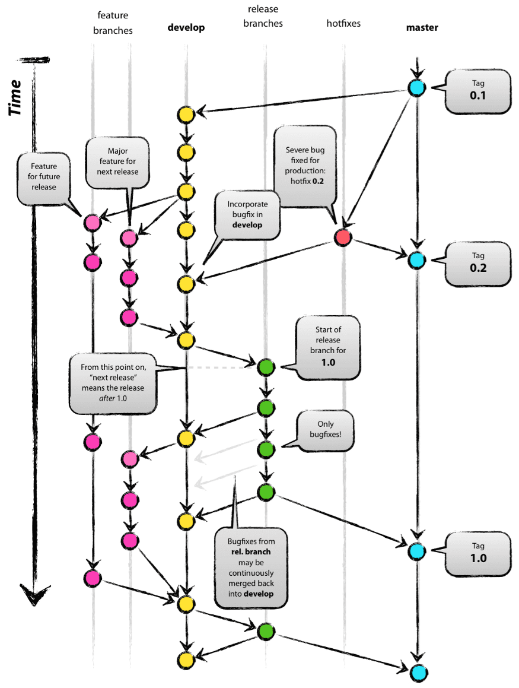

Vamos aprender sobre este fluxo que tem gerado sucesso em muitos times de desenvolvimento de software!

---
## Teoria

É muito comum vermos desenvolvedores utilizando somente uma _branch_ para fazer commits em projetos pessoais. Isto não é errado, é muito tranquilo de se controlar tudo em uma _branch_ quando se está desenvolvendo sozinho, mas o cenário muda bastante quando temos que interagir com mais desenvolvedores, seja em um projeto de código aberto(opensource) ou privado.

Nessas horas é importante que se tenha total controle do que está sendo produzido por sua equipe, onde, ao mesmo tempo são corrigidas falhas, implementadas novas funcionalidades e o ideal é ter o seu código de produção com total funcionamento entregue ao cliente.

É aí que o [Fluxo Git Flow](https://nvie.com/posts/a-successful-git-branching-model/) nos ajuda, olhe a imagem abaixo para entender melhor:

O **Git Flow** é um modelo de conjunto de instruções que você e/ou equipes de desenvolvimento podem seguir para organizar os _branches_.

É importante ressaltar que o Git Flow são **orientações** e **não regras**, ou seja, você não precisa seguir 100% ao pé da letra, acho bacana e até saudável que pensemos em adaptações de acordo com a equipe de desenvolvimento e o modelo de trabalho.

### As branches principais

A **master** deve ser a principal _branch_ onde o código-fonte sempre reflete um estado pronto que, quando versionado, será publicado em produção.

A **develop** sempre deve conter o código mais atual, ou seja, o que está sendo desenvolvido no momento. Isto é possível fazendo com que as _branches_ de features sejam criados através dela e no fim de seu ciclo, todo o código produzido seja mesclado _(merge)_ na **develop**.

Quando o código-fonte na **develop** atinge um ponto estável e está pronto para ser liberado, todas as alterações devem ser mescladas _(merge)_ na **master** de alguma forma e marcadas com um número de release _(tag)_.

> 💡 Iremos nos aprofundar mais detalhadamente sobre os conceitos de branches e tags nos próximos posts.

### As branches de apoio

Junto aos principais _branches_, master e develop, há diversass _branches_ de apoio para _auxiliar_ o desenvolvimento paralelo entre os membros da equipe, _facilitar_ o rastreamento de recursos, _preparar_ releases de produção e ajudar a _corrigir instantaneamente problemas de produção (hotfix)_.

**Ou seja:**
- **feature**: para novas implementações
- **release**: para finalizar releases e tags
- **hotfix**: para resolver problemas críticos em produção que não podem esperar uma nova release

> ⚡ Para saber como configurar o fluxo do Git Flow em um repositório e como criar as branches de apoio de forma dinâmica, navegue pelas publicações com a _tag_ **gitflow**. 

---
**Obrigado por chegar até aqui!** 😄

